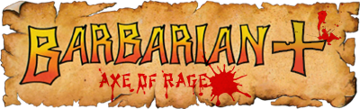
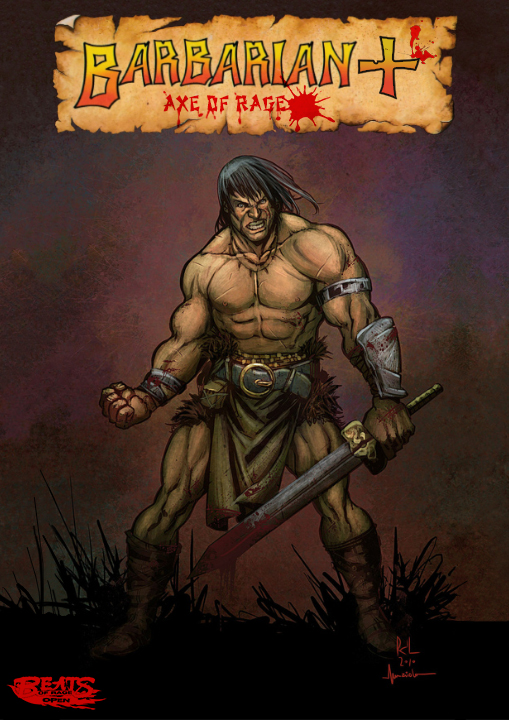

# Barbarian Plus - Axe Of Rage

- Project started by	Kimono the 29/03/2020
- Last release version was 0.2 beta in 4/3 the 05/03/2021
- Darknior joined the team on January 2022
- Now project will show a 16/9 screen ratio

Forum		[Chronocrash](https://www.chronocrash.com/forum/index.php?threads/barbarian-axe-of-rage.4343/)

## Project

Remake of the Amiga "Barbarian Plus" on the OpenBOR engine with the original author agreement.
Amiga games was made by "Colin Vella" for code, "Christoper Romagnoli" for GFX and "saimon69" for SFX in 2018.

Amiga : [Facebook](https://www.facebook.com/BarbarianPlus/)

## Description

FRENCH

Vous contrôlez un barbare anonyme dont le but est de vaincre le sorcier maléfique Drax qui a capturé la princesse Mariana. Pour cela vous devrez affronter d’autres barbares dans des combats à mort en un contre un. Après les avoir vaincus, vous affronterez le sorcier et une fois celui-ci battu, retrouverais Mariana.

Vous pouvez déplacer le personnage dans l’arène et réaliser des sauts et des roulades pour éviter un coup. En maintenant appuyé le bouton d’attaque, vous pouvez donner des coups de pied ou de tête et attaquer avec l'épée. Chaque barbare dispose de douze points de vie, représenté par six cercles dans les coins supérieurs de l’interface, une attaque réussie infligeant un point de dégâts. Mais attention, un seul coup précis porté au cou peut décapiter l’adversaire et le tuer instantanément.

ENGLISH

You control an anonymous barbarian whose goal is to defeat the evil wizard Drax who has captured Princess Mariana. For this you will have to face other barbarians in one on one death battles. After defeating them, you will face the sorcerer and once he is defeated, will find Mariana.

You can move the character around the arena and perform jumps and rolls to avoid a hit. By holding down the attack button, you can kick or head and attack with the sword. Each barbarian has twelve health points, represented by six circles in the upper corners of the interface, with a successful attack dealing one point of damage. But beware, a single precise blow to the neck can behead an opponent and kill him instantly.

## Old updates:

**v0.2c**
22/12/2021

- Add playable skeleton and also as boss
- Add capacity to block for ennemis
- Update the run+jump shorter
- Update the "Head chop", "Chest rip" and "Vertical slash" less eavy
- Add an end animation for Kran
- Update the titlescreen🙂

**v0.2b**
05/03/2021

- Fix some minor bugs. You can now play a beta tournament mode that leads to an ending scene that is not finished

**v0.2a**
28/02/2021

- New enemies: Broda, Drax, Keymaster, Zagul. Every enemies receives a lot of new anims like jump, fall, rise, roll, new attacks... 
- A new tournament: Evil Forces where you meet these enemies (you need to finish the basic Tournament to unlock this one)
- 3 Bonus stages: kill 20 Terror Birds (or 20 Axe Goblins in Evil Forces Tournament), beat the Pit Creature
- Some cutscenes to explain the moves, one true ending for Gorth

**v0.1**
08/01/2021

- First initial demo using "Tenshu" sprites he has kindly accepted to use as a base.
The Barbarian+ facebook page: https://www.facebook.com/BarbarianPlus/

